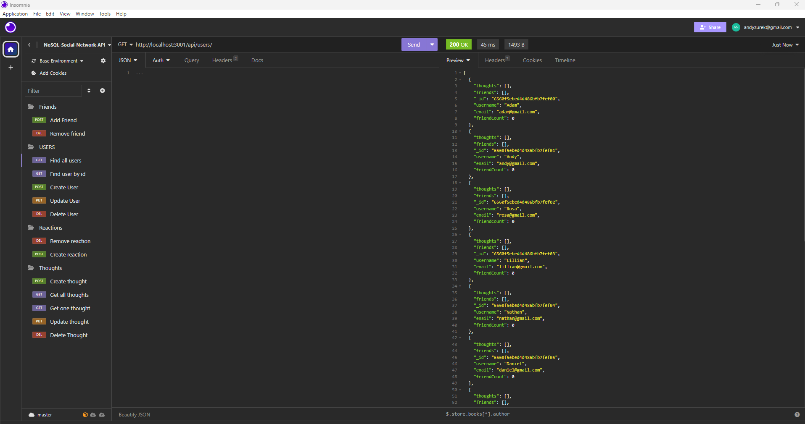

# nosql-social-network-api 

[Link to Walkthrough Video](https://watch.screencastify.com/v/Tp2AvMyNSZOjduf1pa5u)

## Technology Used:

 * node - https://nodejs.org/en/about
 * Insomnia - https://docs.insomnia.rest/insomnia/get-started
 * MongoDB - https://www.mongodb.com/
 * npm - https://www.npmjs.com/
 * express - https://expressjs.com/
 * mongoose - https://www.npmjs.com/package/mongoose

 ## Description

An API for a social network web application where users can share their thoughts, react to friends’ thoughts, and create a friend list. A NoSQL database is being utitlized for the social network API to handle a large amount of unstructed data. 

 ## Table of Contents
  
   * [Installation](#installation)
   * [Usage](#usage)
   * [License](#license)
   * [Badges](#badges)
   * [Tests](#tests)
   * [Contributing](#contributing)
   * [Credits](#credits)

## Installation

This application requires express, and mongoose.  
* To install all dependences, run: npm install
* To load the seeds into the database, run: npm run seed 
* To start the server, run: node server.js

## Usage

Using the POST, PUT, DELETE AND GET methods, the user is able to add, update, delete and view specific information on the database.

Open insomnia, Go to the address bar. Check out the following routes:

  localhost:3001/api/users  -  this route is to get all users or create user
  localhost:3001/api/users/:userId  -  this route is to get one user, update and delete user
  localhost:3001/api/users/:userId/friends/:friendId  -  this route is to add or delete a friend
  localhost:3001/api/thoughts  -  this route is to get all thoughts or create thought
  localhost:3001/api/thoughts/:thoughtId   -  this route is to get one thought, update or delete.
  localhost:3001/api/thoughts/:thoughtId/reactions  -   this route is to create reaction
  localhost:3001/api/thoughts/:thoughtId/reactions/:reactionId   -  this route is to delete reaction

Below is a snippet of some code on the routes created:

    const router = require("express").Router();
    const {getUsers,createUser,updateUser,deleteUser} = require("../../controllers/userController.js");

    router.route("/").get(getUsers)
    router.route("/").post(createUser);
    router.route("/:userId").put(updateUser)
    router.route("/:userId").delete(deleteUser);

    module.exports = router;

A simple setup for MongoDB database. Below is a code snippet:

    const { connect, connection } = require('mongoose');
    const connectionString = process.env.MONGODB_URI || 'mongodb://127.0.0.1:27017/socialDB';

    connect(connectionString);

    module.exports = connection;

To interact with MongoDB, this API uses Mongoose as an ODM. Below are some code snippets on creating models and schemas for the User entities.

    const { Schema, model } = require("mongoose");
    const userSchema = new Schema(
      {
        username: { type: String, required: true, unique: true, trim: true },
        email: {type: String},
        thoughts: [{ type: Schema.Types.ObjectId, ref: "thought" }],
        friends: [{ type: Schema.Types.ObjectId, ref: "user" }],
      },
    );

    const User = model("user", userSchema);

    module.exports =  User;

once you have the Models created you need controllers. Controllers handle the business locgic for each API enpoint.  Below is a code snippet for a get request for a single user:

    async getSingleUser(req, res) {
        try {
          const user = await User.findOne({ _id: req.params.userId })
          if (!user) {
            return res.status(404).json({ message: 'No user with that ID' });
          }
          res.json(user);
        } catch (err) {
          res.status(500).json(err);
        }
      },

## License

 This project is licensed with MIT license

 Link to License - [Website to MIT License]((https://opensource.org/license/mit))

 ## Badges

 

 ## Tests
 
 This application tested the writen code using Insomnia Core application

 ## Contributing

 Contact me if you interested in contributing:

 Check out my [github](https://github.com/AZurek17) page or send me a [email](mailto:andyzurek@gmail.com)

 ## Credits
 * Tutoring Session
 * ChatGPT
 * StudyGroup

 &copy;2023, Written by Andy Zurek